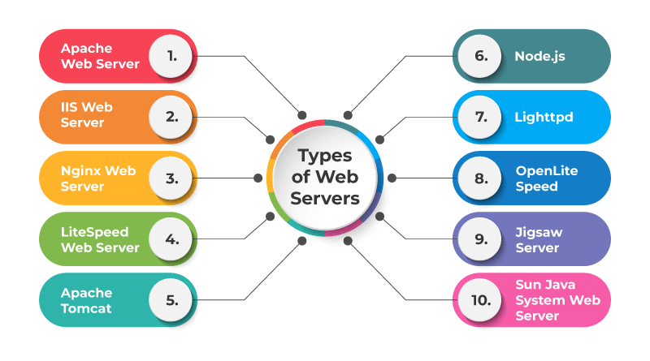
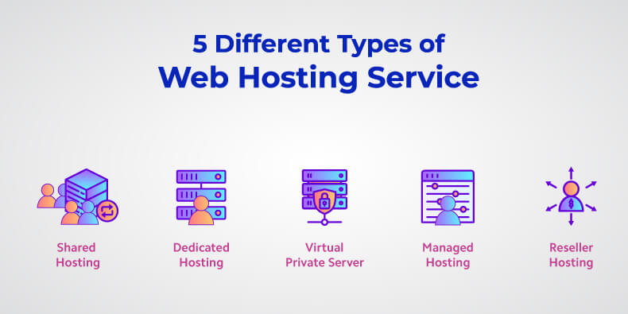

# 1. What is a protocol stack, and how is it used in web development?

## Protocol Stack in Web Development

A protocol stack is a set of protocols and software layers that work together to enable communication between devices over a network. It is a fundamental concept in computer networking and is used to standardize the way data is transmitted, received, and processed across interconnected devices.

In the context of web development, a protocol stack is used to facilitate communication between clients (such as web browsers) and servers that host websites and web applications. The web development protocol stack consists of several layers, each responsible for specific tasks, and it follows a client-server architecture.

## Simplified Overview of the Web Development Protocol Stack:

1. **Application Layer:** This is the topmost layer in the stack and deals with high-level application-specific protocols. For web development, the primary application layer protocol is the Hypertext Transfer Protocol (HTTP). HTTP is used for requesting and transmitting web pages, files, and other resources from the server to the client (web browser).

2. **Transport Layer:** The transport layer is responsible for managing end-to-end communication between devices. The most common transport layer protocol used in web development is the Transmission Control Protocol (TCP). TCP ensures that data is reliably transmitted and received between the client and server.

3. **Network Layer:** The network layer deals with routing and addressing of data packets across the internet. The Internet Protocol (IP) is the core protocol of this layer, and it is responsible for identifying and locating devices using IP addresses.

4. **Link Layer:** This is the lowest layer of the protocol stack, and it handles the physical connection to the network medium, such as Ethernet or Wi-Fi.

When you access a website or web application, your web browser (the client) initiates a request to the server hosting the website. The request travels through the protocol stack on the client-side and is sent over the internet to the server. On the server-side, the request is processed, and the server sends back the requested web page or data to the client through the same protocol stack, but in reverse order.

The server may also use other protocols such as HTTPS (HTTP Secure) for encrypted communication to ensure data privacy and security during transmission.

Overall, the protocol stack in web development ensures that data is efficiently and reliably transmitted between clients and servers, enabling the functioning of websites and web applications over the internet.

# 2. What are the different types of web servers, and how do they differ in terms of functionality and performance?

There are several types of web servers available, each designed to serve web content and handle requests in different ways. The choice of web server depends on factors like the website's requirements, programming language used, operating system, and expected traffic levels. Here are some of the most common types of web servers and their key characteristics in terms of functionality and performance:

**1. Apache HTTP Server (Apache):**

Apache is one of the oldest and most widely used web servers. It is open-source, cross-platform, and supports various operating systems like Linux, Unix, Windows, etc. Apache is highly configurable and extensible, making it a popular choice for a wide range of web applications and websites. Its modular architecture allows administrators to enable or disable specific features as needed, contributing to its flexibility.

**Functionality:** Apache supports multiple programming languages (e.g., PHP, Python, Perl) through modules and has robust support for virtual hosting, allowing multiple websites to be hosted on a single server.

**Performance:** While Apache is a reliable and stable web server, it may not be the most performant option under high loads or concurrent connections compared to some other alternatives.

**2. Nginx (pronounced "Engine X"):**

Nginx is an open-source web server known for its high-performance and low resource usage. Originally designed as a reverse proxy server, it has evolved into a popular web server due to its efficiency in handling concurrent connections and static content.

**Functionality:** Nginx excels at serving static content and is commonly used as a reverse proxy to load balance traffic across multiple application servers. It can also handle dynamic content by working with application servers like PHP-FPM.

**Performance:** Nginx's event-driven architecture allows it to handle a large number of concurrent connections efficiently, making it a preferred choice for high-traffic websites or web applications.

**3. Microsoft Internet Information Services (IIS):**

IIS is a web server developed by Microsoft, primarily designed for Windows Server environments. It integrates well with other Microsoft technologies and is a popular choice for hosting ASP.NET applications and websites.

**Functionality:** IIS offers seamless integration with Windows authentication, ASP.NET, and other Microsoft technologies. It supports various programming languages and frameworks like ASP.NET, PHP, and Python.

**Performance:** IIS is performant and optimized for Windows environments. However, in terms of raw performance and resource utilization, it may not match Nginx or some other lightweight options.

**4. LiteSpeed Web Server:**

LiteSpeed is a commercial web server that aims to deliver high performance and security while being compatible with Apache configurations. It can be used as a drop-in replacement for Apache, offering better performance and reduced server load.

**Functionality:** LiteSpeed supports Apache-compatible configurations, making migration from Apache relatively straightforward. It includes built-in features like cache acceleration and security features.

**Performance:** LiteSpeed claims to outperform Apache and Nginx in certain scenarios, especially when it comes to serving static content and handling high-traffic websites.

Ultimately, the choice of web server depends on specific needs and requirements. Factors like website traffic, content type, server resources, and the level of control needed will influence the decision. It's essential to conduct benchmark tests and consider the features offered by each web server to determine the best fit for your web development project.

## 3. What is web hosting, and what are the different types of hosting services available for websites?

Web hosting is a service that allows individuals and organizations to make their websites accessible on the internet. When you create a website, all the files, images, and other content that make up your site need to be stored on a web server. Web hosting companies provide the infrastructure and technologies necessary to store and serve these website files so that visitors can access your site from anywhere in the world.

Different types of hosting services are available to cater to various website needs. Here are some of the common types of web hosting:

**1. Shared Hosting:**

Shared hosting is a cost-effective option where multiple websites are hosted on the same server. Each website shares the server's resources, such as CPU, RAM, and disk space. This type of hosting is suitable for small websites or beginners with low to moderate traffic. However, since resources are shared, performance can be affected if other sites on the same server experience spikes in traffic.

**2. Virtual Private Server (VPS) Hosting:**

VPS hosting provides a more isolated environment compared to shared hosting. While multiple websites are still hosted on the same physical server, each website has its own virtualized operating system, ensuring a dedicated allocation of resources. This improves performance and stability compared to shared hosting. VPS hosting is suitable for websites with moderate traffic and resource requirements.

**3. Dedicated Server Hosting:**

Dedicated hosting offers an entire physical server dedicated solely to one website or application. This provides maximum control, flexibility, and performance. Dedicated hosting is ideal for large websites, high-traffic online stores, and applications that require extensive resources and customization options.

**4. Cloud Hosting:**

Cloud hosting utilizes a network of interconnected virtual and physical servers to host websites. The resources required for hosting are distributed across this network, and websites can easily scale up or down based on demand. Cloud hosting offers high reliability, flexibility, and the ability to handle traffic spikes effectively. It is suitable for websites with varying traffic levels and resource requirements.

**5. Managed WordPress Hosting:**

Managed WordPress hosting is specifically optimized for WordPress websites. The hosting provider takes care of tasks such as automatic updates, backups, and security, allowing website owners to focus on content creation and management. This type of hosting is ideal for WordPress users who want a hassle-free experience.

**6. Reseller Hosting:**

Reseller hosting allows individuals or companies to purchase hosting resources (such as disk space and bandwidth) from a hosting provider and then resell them to their clients. This is suitable for web developers, agencies, or individuals who want to offer hosting services as part of their business.

Each type of hosting service has its pros and cons, and the right choice depends on factors such as the website's size, traffic volume, technical expertise, and budget. It's essential to carefully evaluate the hosting needs and compare different hosting providers before making a decision.

## 4. What is scaling, and why is it important for web applications? How does scaling differ for vertical and horizontal scaling?

Scaling, in the context of web applications, refers to the ability to handle increasing amounts of traffic, data, or user demand in a way that maintains the performance and responsiveness of the application. It involves adding more resources, such as servers, storage, or processing power, to the system as the application's requirements grow. Scaling is essential for web applications because as they gain popularity and attract more users, they need to be able to handle the increased workload without becoming slow or unresponsive.

There are two main approaches to scaling web applications: vertical scaling and horizontal scaling.

**1. Vertical Scaling:**

Vertical scaling, also known as scaling up, involves adding more resources to a single server to increase its capacity. This usually means upgrading the server's hardware, such as adding more RAM, increasing the CPU power, or expanding storage capacity. The goal is to make the individual server more capable of handling increased traffic and resource demands.

**Advantages of Vertical Scaling:**

- Simplicity: Vertical scaling can be simpler to implement, as it involves upgrading the existing server.
- Single Point of Management: Managing one large server is often easier than managing multiple smaller servers.

**Limitations of Vertical Scaling:**

- Costly: Upgrading hardware components of a server can be more expensive, especially for high-performance upgrades.
- Limited Scalability: There is a practical limit to how much a single server can be scaled vertically. Eventually, hardware constraints are reached.

**2. Horizontal Scaling:**

Horizontal scaling, also known as scaling out, involves adding more servers to distribute the workload across multiple machines. Instead of upgrading a single server, horizontal scaling aims to increase the application's capacity by adding more servers to share the load.

**Advantages of Horizontal Scaling:**

- Cost-Effectiveness: Horizontal scaling allows businesses to start with a smaller infrastructure and add more servers as the demand grows, making it more cost-effective in the long run.
- Better Fault Tolerance: With multiple servers, if one fails, the other servers can continue to handle the traffic, ensuring better fault tolerance and reliability.

**Limitations of Horizontal Scaling:**

- Complexity: Implementing horizontal scaling can be more complex than vertical scaling, as it requires managing multiple servers and distributing the workload effectively.
- Data Consistency: Maintaining data consistency across multiple servers can be challenging, especially in distributed databases.

Scaling in web applications is important because it ensures that the application remains available, responsive, and reliable even during periods of high traffic or usage. It helps prevent performance bottlenecks, reduces the risk of downtime, and provides a positive user experience.

## 5. What is SEO (Search Engine Optimization), and how can web developers optimize their websites for better search engine rankings?

SEO, or Search Engine Optimization, is the practice of improving a website's visibility and ranking in search engine results pages (SERPs) organically. The goal of SEO is to increase the website's traffic by attracting relevant and targeted visitors from search engines like Google, Bing, and others. When a website ranks higher in search results, it is more likely to be seen and visited by users searching for related topics, products, or services.

Web developers play a crucial role in optimizing websites for better search engine rankings. Here are some key strategies and techniques they can implement:

**1. Keyword Research:**

Perform keyword research to identify relevant and high-traffic keywords and phrases related to the website's content and target audience. Use tools like Google Keyword Planner or SEMrush to find valuable keywords that align with the website's goals.

**2. On-Page Optimization:**

- Use the chosen keywords strategically in page titles, headings (H1, H2, etc.), and meta descriptions.
- Create unique, descriptive, and keyword-rich URLs for each page.
- Optimize the website's content by using relevant keywords naturally and providing valuable information to users.
- Ensure the website is mobile-friendly and has fast-loading pages, as mobile-friendliness is a crucial factor in search rankings.

**3. High-Quality Content:**

Develop high-quality, informative, and engaging content that satisfies the needs of the target audience. Regularly update and add fresh content to keep the website relevant and current.

**4. Site Structure and Navigation:**

Ensure that the website has a clear and logical site structure. Use a user-friendly navigation system that allows search engines to crawl and index the site effectively.

**5. Internal Linking:**

Implement internal linking by linking related pages and content together. This helps search engines understand the website's structure and establishes a hierarchy of importance for different pages.

**6. Image Optimization:**

Optimize images by using descriptive file names and alt tags, which not only improve accessibility but also provide additional context to search engines about the content.

**7. Use SSL Certificate:**

Secure your website with an SSL certificate (HTTPS) to establish trust with users and search engines. Secure sites are often favored in search rankings.

**8. Page Speed Optimization:**

Optimize the website's performance and loading speed by compressing images, leveraging browser caching, and reducing server response time. Faster-loading websites tend to rank higher in search results.

**9. Schema Markup:**

Implement schema markup to provide search engines with structured data that helps them understand the content and context of the website better. This can lead to rich snippets and improved visibility in search results.

**10. External Link Building:**

Encourage natural external link building by creating shareable and link-worthy content. Backlinks from authoritative and relevant websites can significantly impact search rankings.

**11. Social Media Integration:**

Integrate social media sharing buttons and encourage social sharing of content to increase the visibility and reach of the website.

It's essential to note that SEO is an ongoing process, and search engine algorithms are continuously evolving. Web developers should keep themselves updated with the latest SEO best practices and algorithm changes to ensure their websites remain optimized and competitive in search engine rankings. Additionally, focusing on user experience and providing valuable content will not only improve search rankings but also lead to better engagement and higher conversion rates.

## Resources Referred :

1. https://btninfosolution.in/top-10-prominent-reasons-of-why-seo-is-important-for-a-business/
2. https://www.milesweb.in/blog/hosting/web-server-types-web-servers/
3. https://www.redswitches.com/blog/types-of-web-hosting/
4. https://moz.com/beginners-guide-to-seo
